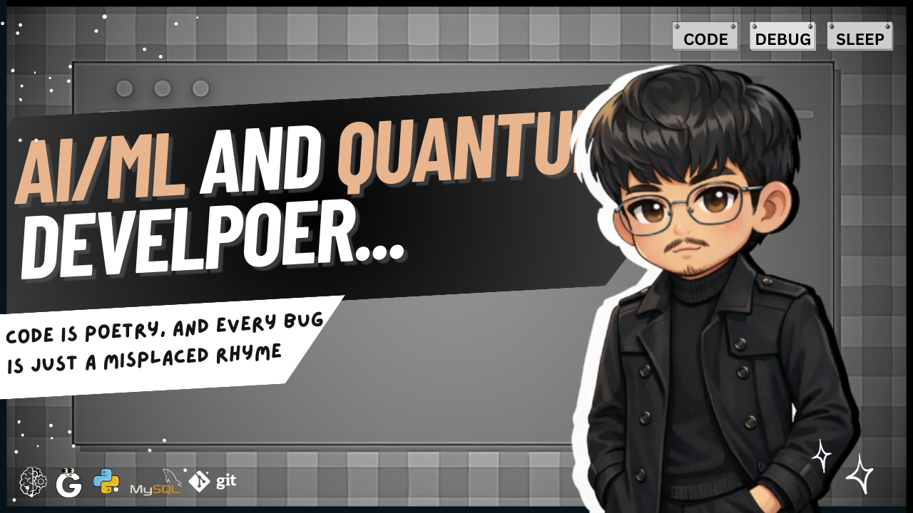

# Hi, I'm Drona 👨‍💻  
**Flutter Developer | Quantum Computing Enthusiast | Problem Solver**  
*Building digital experiences that matter*

Welcome to my GitHub! I'm a passionate developer crafting beautiful mobile apps with Flutter while exploring the frontiers of quantum computing. When I'm not coding, you'll find me solving algorithmic challenges or contributing to open-source projects.

---

## 🚀 Tech Stack & Superpowers

### **Mobile Development**

### **Programming Languages**

### **Cloud & Backend**

### **Databases**

### **Quantum Computing**

### **DevOps & Tools**

---

## 🌟 Featured Projects

### **🚀 FLUTTER ICON** - *Open Source UI Library*

*Founder & Lead Developer*

> A comprehensive UI component library with **50+ hover effects**, **200+ scalable icons**, and animated components. Accelerating development workflows with modular, reusable components.

**Impact:** 📈 **38% faster UI development** | **20+ downloads** | **10+ adopted projects**

### **🔐 QUSAFE** - *Post-Quantum Cryptography Toolkit*

> Educational toolkit demonstrating **6 cryptographic algorithms** with live security comparisons and quantum resistance analysis.

**Tech:** NumPy | Matplotlib | JupyterLab | Quantum Algorithms

### **🎲 RNQU** - *Quantum Random Number Generator*

> Quantum randomness toolkit featuring **4 generation methods** with real-time visualization and entropy testing.

**Features:** Hadamard qubits | Bell states | GHZ states | NIST-based methods

---

## 📊 GitHub Stats & Achievements

**🚀 190+ LeetCode Problems Solved**  
**🎯 Target: 250+** | **Focus: DP, Graphs, Greedy Algorithms**

---

## 🎓 Education & Certifications

### **North Eastern Hill University, Shillong**
🎓 **B.Tech in Information Technology**  
📅 *Aug 2023 - July 2027* | **CGPA: 8.27**

### **Certifications & Achievements**
| **Certification** | **Skills Gained** | **Status** |
|------------------|------------------|------------|
| **Google Cloud Platform** | Cloud Vision, GenAI, Networking, API Gateways | ✅ Completed |
| **Microsoft & Google Workspace** | Productivity Tools, Collaboration | ✅ Completed |
| **Quantum Computing (IBM)** | Qiskit, Quantum Algorithms, Grover's Algorithm | 🎯 In Progress |
| **Data Structures & Algorithms** | Advanced Problem Solving | 🏆 190+ Problems |

---

## 💼 Professional Experience

### **GDG Shillong** - *Technical Volunteer*
> Organized workshops and served as tutor for Flutter development sessions, mentoring 50+ students in mobile app development fundamentals.

### **Cipher Club** - *Assistant Executive Secretary*
> Organized **5+ technical events** with 200+ participants | Created hybrid treasure hunt games | Led team coordination and technical planning

---

## 🛠️ Development Environment

### **💻 Hardware**

### **🌐 Operating Systems**

---

## 📬 Let's Connect & Collaborate!

---

## 🌱 Currently Exploring

- **Advanced Flutter Animations** & Native Integrations
- **Quantum Machine Learning** Algorithms
- **Serverless Architecture** with Firebase Functions
- **Advanced Algorithm Design** & Optimization

---

### **💡 "Code is poetry, and every bug is just a misplaced rhyme"**

⭐ *Feel free to explore my repositories and don't hesitate to reach out for collaborations!*

**Visitors Count**  

