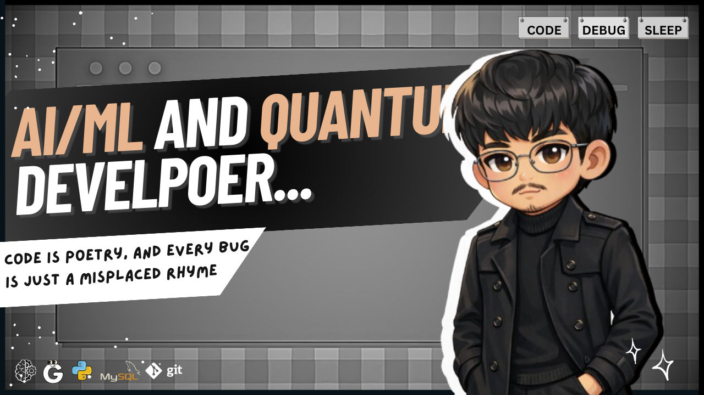

# Hi, I'm Drona

**AI/ML Developer | Quantum Computing Enthusiast | Flutter Problem Solver**  
*Building digital experiences that matter*

Welcome to my GitHub! I'm a passionate developer crafting beautiful mobile apps with Flutter while exploring the frontiers of quantum computing. When I'm not coding, you'll find me solving algorithmic challenges or contributing to open-source projects.

---

## 🚀 Tech Stack & Superpowers

### **Mobile Development**

### **Programming Languages**

### **Cloud & Backend**

### **Databases**

### **Quantum Computing**

### **DevOps & Tools**

---

##  Featured Project Collections

### 100 Quantum Computing Projects

> A structured collection of **100 quantum computing projects**, ranging from fundamentals (qubits, superposition, entanglement) to advanced concepts like quantum algorithms, simulations, and post-quantum cryptography.

**Focus Areas:** Qiskit | Cirq | Quantum Algorithms | Quantum Information Theory

---

### 100 AI/ML Projects

> End-to-end **AI & ML projects built from scratch**, emphasizing mathematical intuition, model implementation, and real-world datasets.

**Focus Areas:** ML from Scratch | Classical ML | Applied AI | Model Evaluation

---

## 📊 GitHub Stats & Problem Solving

**🚀 190+ LeetCode Problems Solved**  
**🎯 Target: 250+ | Focus: DP, Graphs, Greedy Algorithms**

---

## 🟢 GitHub Status Window

---

## 🎓 Education & Certifications

### **North Eastern Hill University, Shillong**

🎓 **B.Tech in Information Technology**
📅 *Aug 2023 – July 2027* | **CGPA: 9.01**

### **Certifications & Achievements**

| Certification                | Skills Gained                | Status           |
| ---------------------------- | ---------------------------- | ---------------- |
| Google Cloud Platform        | GenAI, Networking, APIs      | ✅ Completed      |
| Microsoft & Google Workspace | Productivity & Collaboration | ✅ Completed      |
| Quantum Computing (IBM)      | Qiskit, Quantum Algorithms   | 🎯 In Progress   |
| Data Structures & Algorithms | Advanced Problem Solving     | 🏆 190+ Problems |

---

## 💼 Professional Experience

### **GDG Shillong** – *Technical Volunteer*

> Conducted Flutter workshops and mentored 50+ students on mobile app development fundamentals.

### **Cipher Club** – *Assistant Executive Secretary*

> Organized 5+ technical events with 200+ participants and led technical planning and execution.

---

## 📬 Let's Connect & Collaborate

  
 🔦 Profiles: 

   <table>
     <tr>
       <td> <a href="https://www.linkedin.com/in/dronabopche/"> Linkedin </a></td>
       <td> <a href="https://medium.com/@dronabopche"> Medium </a></td>
       <td> <a href="https://dronabopche.vercel.app/"> Portfolio </a></td>
       <td> <a href="https://leetcode.com/dronabopche/"> Leetcode </a></td>
       <td> <a href="https://huggingface.co/dronabopche"> HuggingFace </a></td>
       <td> <a href="https://app.datacamp.com/portfolio/dronabopche"> DataCamp </a></td>
       <td> <a href="https://codeforces.com/profile/dronabopche"> CodeForces </a></td>
       <td> <a href="https://www.kaggle.com/dronabopche"> Kaggle </a></td>
     </tr>
     <tr>
<td> </td>
<td> </td>
<td> </td>
<td> </td>
<td> </td>
<td> </td>
<td> </td>
<td> </td>
     </tr>
  </table>

---

### **“Code is poetry, and every bug is just a misplaced rhyme.”**

---

